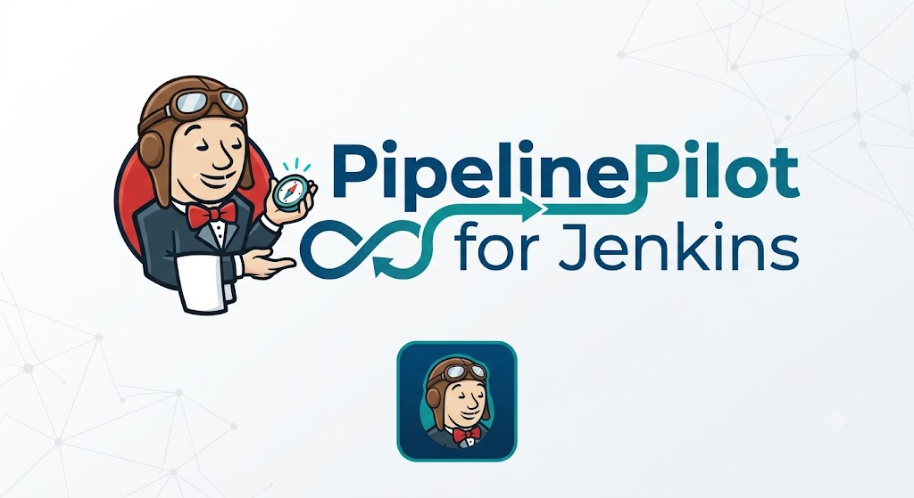

<div align="center">



# PipelinePilot for Jenkins

**Edit · Validate · Run · Stream — Jenkins pipelines without the commit-push-wait loop.**

A professional IntelliJ IDEA plugin (plus a Jenkins companion plugin) that brings a
fast, interactive, modern developer experience to Jenkins Pipeline development.

</div>

---

## Why

Authoring a `Jenkinsfile` today usually means the slowest feedback loop in the
stack:

```
edit  →  commit  →  push  →  wait for an executor  →  fail on a typo  →  repeat
```

A misplaced brace or a missing `agent` can cost minutes per iteration. Existing IDE
tooling stops at syntax highlighting because **fully emulating an enterprise Jenkins
locally is impractical** — the plugins, shared libraries, credentials, agents, and
runtime simply can't be reproduced on a laptop.

PipelinePilot takes a different stance:

> **Don't emulate Jenkins. Borrow it.**

The IDE handles the *experience* (editing, diagnostics, visualization); a real Jenkins
instance handles the *truth* (validation, execution, plugins, credentials, agents).
The result is the target workflow:

```
Edit Jenkinsfile  →  Ctrl+Enter  →  runs remotely in a sandbox  →  logs & stages stream back instantly
```

## Architecture — remote-assisted development

```
┌──────────────────────────┐         HTTPS (token + CSRF)        ┌──────────────────────────┐
│   IntelliJ IDEA plugin    │  ───────────────────────────────▶  │   Jenkins companion plugin │
│   (Kotlin)                │                                     │   (Java, /ide/* endpoints) │
│                           │  ◀───────────────────────────────  │                            │
│ • editor + diagnostics    │      logs / stages / status         │ • declarative validation   │
│ • validation UX           │                                     │ • ephemeral sandbox runs   │
│ • Run/Replay controls      │                                     │ • progressive log stream   │
│ • stage graph             │                                     │ • Groovy-sandbox isolation │
│ • streaming log console   │                                     │ • cleanup of temp jobs     │
└──────────────────────────┘                                     └──────────────────────────┘
```

| The IDE provides | Jenkins provides |
|------------------|------------------|
| editing, highlighting, PSI | real declarative validation |
| inline diagnostics + quick-fixes | sandbox execution on real agents |
| run / replay controls | plugins, shared libraries, credentials |
| stage visualization | Kubernetes / Docker / Vault / Artifactory |
| streaming logs | the actual runtime your pipeline targets |

Submitted scripts run under the **Groovy sandbox** in throwaway jobs under
`IDE-SANDBOX/<user>/`, which are deleted on completion — the original pipeline
configuration is never mutated.

## Features

- **Instant validation** — inline diagnostics with gutter markers from the real
  Jenkins declarative linter, on save or via `Ctrl+Alt+V`.
- **Quick-fixes** — deterministic (e.g. *Add `agent any`*) and AI-assisted
  (*Suggest fix*) intentions on linter errors.
- **Remote sandbox execution** — `Ctrl+Enter` runs the current Jenkinsfile on a real
  Jenkins, isolated and ephemeral. Declarative & scripted, shared libraries, and
  enterprise plugins all work because it's the real runtime.
- **Real-time logs** — timestamped console streaming inside a tool window.
- **Stage graph** — live visualization of sequential, parallel, and nested stages
  with status colors, derived from the Jenkins flow graph.
- **Replay** — rerun the whole pipeline, only-failed stages, or a single stage
  (right-click a stage box).
- **Shared library awareness** — `@Library` detection, `vars/` step autocomplete, and
  Ctrl+Click navigation into `vars/<step>.groovy`.
- **AI assistance (optional, provider-agnostic)** — suggested fixes and pipeline
  optimization recommendations via any **OpenAI-compatible** Chat Completions endpoint
  (OpenAI, Azure OpenAI, OpenRouter, Ollama, LM Studio, vLLM, opencode, …).

## Project layout

```
pipelinepilot/
├── intellij-plugin/      IntelliJ IDEA plugin (Kotlin)
├── jenkins-plugin/       Jenkins companion plugin (Java, Maven → .hpi)
├── common-api/           Shared request/response DTOs (Kotlin)
├── docs/                 UI mockups, assets
└── examples/             Sample Jenkinsfiles + demo-workspace + shared-lib
```

## API contract (`/ide/*`)

| Method | Path | Purpose |
|--------|------|---------|
| `POST` | `/ide/validate` | declarative validation → `{valid, diagnostics[]}` |
| `POST` | `/ide/runSandbox` | start an ephemeral run → `{sessionId, accepted}` |
| `POST` | `/ide/replay` | replay (whole / failed / single stage) |
| `GET`  | `/ide/logs?sessionId=&start=N` | progressive logs + stage events |
| `POST` | `/ide/session?sessionId=` | destroy the temporary execution |

Mutating endpoints require a CSRF crumb and check caller permissions
(`Jenkins.READ`, `Item.CREATE`, `Item.DELETE`).

## Quick start

### 1. Run a demo Jenkins (Docker)

```bash
docker compose up -d --build      # http://localhost:8080  (admin / admin)
```

This builds a Jenkins LTS image with the companion plugin and a seeded
`demo-complex-pipeline` job preinstalled.

### 2. Install the IDE plugin

Build it (or grab the artifact):

```bash
./gradlew :intellij-plugin:buildPlugin
# → intellij-plugin/build/distributions/intellij-plugin-<version>.zip
```

In IntelliJ IDEA: **Settings ▸ Plugins ▸ ⚙ ▸ Install Plugin from Disk…**, pick the
zip, restart.

> Building against a locally installed IDE (exact binary match, no SDK download):
> `./gradlew :intellij-plugin:buildPlugin -PlocalIdePath="<IDE install path>"`

### 3. Connect

**Settings ▸ Tools ▸ PipelinePilot for Jenkins**

- Jenkins URL: `http://localhost:8080`, Username: `admin`, API token (create under
  *user ▸ Security*).
- *(optional)* Shared library roots — local checkouts containing `vars/`.
- *(optional)* AI — enable, set base URL / model / key for any OpenAI-compatible
  provider.

Open `examples/demo-workspace/Jenkinsfile` and press **`Ctrl+Enter`**.

## AI features

When AI assistance is enabled, PipelinePilot can:

- **Suggest fixes for validation errors** — `Alt+Enter` on a linter error ▸
  *Suggest fix (AI)*. The model explains the root cause and returns a corrected
  Jenkinsfile, which you can apply in one click (single undo step).
- **Analyze a pipeline** — right-click ▸ *Analyze Pipeline (AI)*. Streams a prioritized
  list of optimization and best-practice recommendations (caching, parallelism,
  security, maintainability) into the Logs console.
- **Work with any provider** — pick OpenAI, OpenRouter, a local model (Ollama / LM
  Studio), or a custom OpenAI-compatible gateway from a dropdown; the base URL and a
  suggested model auto-fill and remain editable.
- **Verify connectivity** — a **Test Connection** button pings the endpoint and shows
  a green/red status before you rely on it.

> Roadmap: AI-generated stage suggestions and shared-library step synthesis.

## AI configuration (provider-agnostic)

PipelinePilot speaks the OpenAI **Chat Completions** wire format, so it works with any
compatible endpoint — no vendor lock-in.

Pick a provider from the dropdown in settings — the base URL and a suggested model
auto-fill (both editable), then add a key if the provider needs one.

| Provider | Base URL | Key |
|----------|----------|-----|
| OpenAI | `https://api.openai.com/v1` | required |
| OpenRouter | `https://openrouter.ai/api/v1` | required |
| Local — Ollama | `http://localhost:11434/v1` | not needed |
| Local — LM Studio | `http://localhost:1234/v1` | not needed |
| Custom / gateway | your URL (LiteLLM, vLLM, LocalAI, corporate proxy) | as required |

> **opencode** is an agent CLI, not an OpenAI `/chat/completions` server — point
> PipelinePilot at opencode's underlying provider, or run a LiteLLM proxy and use
> the **Custom** option.

## Security

- API tokens and AI keys are stored in the OS-backed **PasswordSafe**, never in plain
  config.
- Token-based auth, CSRF crumbs, and per-endpoint RBAC checks on the companion side.
- Sandbox isolation via the Groovy sandbox + disposable jobs; credentials are never
  exposed to the IDE (only required credential IDs are surfaced).

## Build & test

```bash
./gradlew :common-api:build :intellij-plugin:test     # IDE side
cd jenkins-plugin && mvn -DskipTests package           # companion → target/pipelinepilot.hpi
```

Requirements: JDK 21 (IDE plugin), JDK 17+ (companion), Docker (demo stack).

## Status

| Phase | Scope | State |
|-------|-------|-------|
| 1 | Detection · validation · inline diagnostics | ✅ |
| 2 | Sandbox execution · log streaming · tool window | ✅ |
| 3 | Stage graph · replay · shared-library awareness | ✅ |
| 4 | AI-assisted fixes · pipeline analysis | ✅ |
| — | Jenkins companion plugin (`/ide/*`) | ✅ |

Verified end-to-end against a Dockerized Jenkins LTS with a complex
parallel declarative pipeline. See [`PROJECT_PLAN.md`](PROJECT_PLAN.md) for the full
roadmap and [`docs/UI_MOCKUPS.md`](docs/UI_MOCKUPS.md) for UI walkthroughs.

## License

[Apache-2.0](LICENSE).

---

<div align="center"><sub>PipelinePilot — make Jenkins pipeline development feel modern, fast, and safe.</sub></div>
